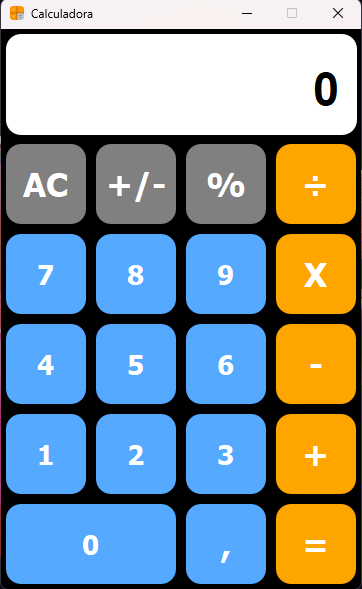

# Calculadora do Iphone 
 
<div align="center">



</div>

> Projeto desenvolvido durante o periodo do curso
Ténico em Desenvolvimento de Sistema no Senac Sorocaba.

## 💻 Pré-requisitos

Antes de começar, verifique se você atendeu aos seguintes requisitos:

- Você instalou a versão mais recente de `Python 3.12`
- Você tem uma máquina `Windows | Linux`.
  
- Configurado o Ambiente Virtual:
  - `python -m venv env`
    
- Instalação das dependendias:
    - `PyQt5`
    - `Auto-Py-To-Exe`

### Ajustes e melhorias

O projeto ainda está em desenvolvimento e as próximas atualizações serão voltadas nas seguintes tarefas:

- [x] Interface Gráfica
- [x] Layout do Iphone
- [ ] Ajustar tamanho da fonte do display
- [ ] Implementar notação cientifica
- [ ] Prédefinir o tamanho fixo da interface

## 🚀 Instalando Calculadora Iphone

Para instalar o Calculadora Iphone, siga estas etapas:

Windows:
```
python -m venv env
env\Scripts\Activate.ps1
python -m pip install pyqt5
python -m pip install auto-py-to-exe
```

## ☕ Usando Calculadora Iphone

Para usar Calculadora Iphone, siga estas etapas:

```
python main.py
```

## 📫 Contribuindo para Calculadora Iphone

Para contribuir com Calculadora Iphone, siga estas etapas:

1. Bifurque este repositório.
2. Crie um branch: `git checkout -b Calculadora-IPhone`.
3. Faça suas alterações e confirme-as: `git commit -m '<mensagem_commit>'`
4. Envie para o branch original: `git push origin <nome_do_projeto> / <local>`
5. Crie a solicitação de pull.

Como alternativa, consulte a documentação do GitHub em [como criar uma solicitação pull](https://help.github.com/en/github/collaborating-with-issues-and-pull-requests/creating-a-pull-request).

## 🤝 Colaboradores

Agradecemos às seguintes pessoas que contribuíram para este projeto:

<table>
  <tr>
  <table>
  <tr>
    <td align="center">
      <a href="#" title="Bruno Mendes">
        <br>
      </a>
    </td>
  </tr>
</table>

## 😄 Seja um dos contribuidores
 
Quer fazer parte desse projeto? Clique [AQUI](CONTRIBUTING.md) e leia como contribuir.
 
## 📝 Licença
Em Desenvolvimento..... 🛠️